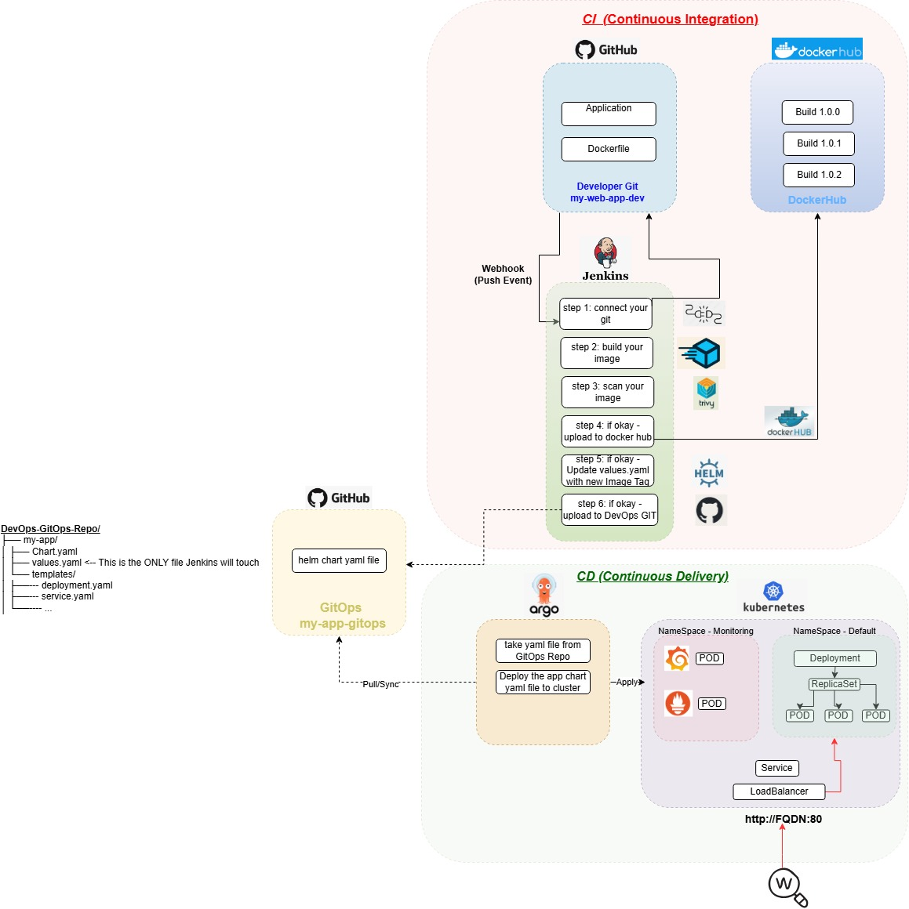

# John Bryce DevOps Project: End-to-End GitOps Pipeline
**Author:** Moshe Bittan

## 📌 Project Overview
This project demonstrates a modern, fully automated Continuous Integration and Continuous Delivery (CI/CD) pipeline using the GitOps methodology. It establishes a strict separation between application code and infrastructure state, ensuring secure, zero-downtime deployments to a Kubernetes cluster.

## 🏗️ Architecture Diagram


## 🛠️ Technology Stack
* **Application:** Python (Flask)
* **Containerization:** Docker
* **CI Server:** Jenkins (Automated via GitHub Webhooks)
* **Security:** Trivy (Vulnerability Scanning)
* **Artifact Registry:** DockerHub
* **CD / GitOps Controller:** ArgoCD
* **Infrastructure as Code:** Helm
* **Kubernetes Environment:** Local `kind` cluster (VMware Linux)
* **Networking:** MetalLB (Local LoadBalancing)
* **Observability:** Prometheus & Grafana (kube-prometheus-stack)

## 📂 Repository Structure
To maintain security and prevent deployment loops, the pipeline is split into two distinct repositories:

1. **[Developer Git (CI)](https://github.com/MosheBittan/my-web-app-dev/tree/main):** Contains the Python application code, Dockerfile, and the declarative `Jenkinsfile`.
2. **[GitOps Git (CD)](https://github.com/MosheBittan/my-app-gitops/tree/main):** The single source of truth for the cluster state. Contains the Helm charts, Kubernetes manifests, and ArgoCD bootstrapping configurations.

## 🔄 The Automation Flow (How it Works)

### Phase 1: Continuous Integration (Push)
1. A developer commits code to the `my-web-app-dev` repository.
2. A GitHub Webhook instantly triggers the Jenkins pipeline.
3. Jenkins builds the new Docker image and tags it with the unique Build ID.
4. **DevSecOps:** Jenkins runs a Trivy security scan on the image to ensure no critical vulnerabilities exist before deployment.
5. Upon passing, Jenkins pushes the secure artifact to DockerHub.
6. Jenkins clones the `my-app-gitops` repository, automatically updates the `values.yaml` file with the new image tag, and pushes the commit back to GitHub.

### Phase 2: Continuous Delivery (Pull)
1. **ArgoCD** continuously monitors the `my-app-gitops` repository.
2. Detecting the new commit from Jenkins, ArgoCD initiates a sync process.
3. ArgoCD pulls the updated Helm chart and performs a rolling update on the Kubernetes pods, transitioning traffic to the new version with zero downtime.
4. The application is exposed locally via **MetalLB**, simulating a cloud-provider LoadBalancer.

### Phase 3: Observability & Self-Healing
* The cluster includes a dedicated monitoring namespace where **Prometheus** scrapes metrics and **Grafana** visualizes cluster health. 
* Because ArgoCD maintains the declarative state, if a pod is manually deleted or crashes, ArgoCD automatically spins up a replacement to maintain the desired state defined in Git.

## 🚀 Bootstrapping the Cluster
To spin up this entire environment from scratch on a new cluster, only two manual steps are required:
1. Install ArgoCD on the cluster.
2. Apply the root ArgoCD application manifest:
   ```bash
   kubectl apply -f [https://raw.githubusercontent.com/MosheBittan/my-app-gitops/main/bootstrap/argocd-app.yaml](https://raw.githubusercontent.com/MosheBittan/my-app-gitops/main/bootstrap/argocd-app.yaml)
